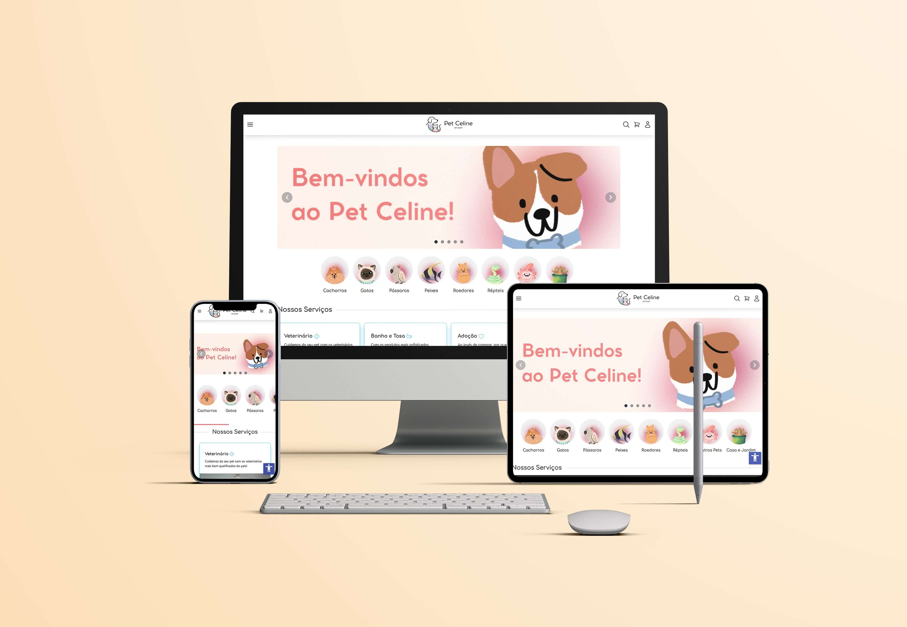

# Pet Celine

 

## :ballot_box_with_check: Tópicos
- [Descrição do Projeto](#file_folder-descrição-do-projeto);
- [Funcionalidades](#heavy_check_mark-funcionalidades)
- [Demonstração](#computer-demonstração);
- [Tecnologias Utilizadas](#hammer-tecnologias-utilizadas);
- [Acessar o Projeto](#link-acessar-o-projeto);
- [Autora](#id-autora).

## :file_folder: Descrição do Projeto
Uma página E-commerce **responsiva** de um pet shop chamado Pet Celine (fictício) - feita utilizando o framework **tailwind** e duas bibliotecas de componentes: **Flowbite** e **DaisyUI**. Para melhorar a acessibilidade do site, usei um pacote **npm** chamado accessibility, trazendo para tela um botão característico que possui várias opções de acessibilidade; fazendo com que o e-commerce fique acessível para todos.

## :heavy_check_mark: Funcionalidades
> :heavy_check_mark: Funcionalidade 1: Botão de acessibilidade (funções como: diminuir espaçamento de textos, inverter cores, aumentor o cursor e etc.).

> :heavy_check_mark: Funcinalidade 2: Formulário de login.

> :heavy_check_mark: Funcinalidade 3: Formulário de cadastro.

## :computer: Demonstração

## :hammer: Tecnologias Utilizadas

      

## :link: Acessar o Projeto

Acesse aqui a [página]()

## :id: Autora
**Letícia Frulani**